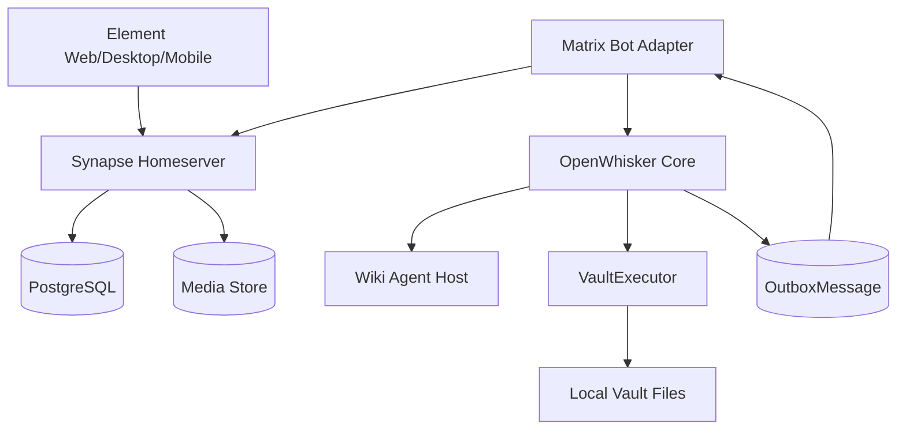

# Matrix Adapter 实践

本文是 OpenWhisker 基于 Matrix 的 IM Adapter 实践文档。

Matrix 是 OpenWhisker 首期核心 IM 入口，用来承载低摩擦 raw capture、命令触发、人工审批、状态通知和执行结果回传。它属于交互层，不是 vault 写入层；所有 vault 变更仍必须经过：

```text
Matrix message
  -> Matrix Adapter
  -> OpenWhisker Core
  -> WikiJob
  -> VaultPlan
  -> Policy Check / Diff / Risk Classification
  -> Human Approval or Low-Risk Auto-Allow
  -> VaultExecutor
  -> OutboxMessage
  -> Matrix Adapter
  -> Matrix room
```

本文使用 `Matrix Adapter` 作为统一名称。`Adaptor` 在语义上等价，但 repo 内路径、代码和文档链接优先使用 `adapter` 拼写。

## 核心结论

首期采用 `Synapse + PostgreSQL + Caddy + Docker Compose + Element 客户端 + Matrix bot adapter`。

默认入站模型是 Matrix bot 账号通过 Matrix Client-Server API 的 `/sync` 接收消息，再把用户输入提交给 OpenWhisker Core。Webhook Relay 只作为可选的外部 webhook 或出站通知辅助，不作为 Matrix 入站主路径。

明确不做：

- 不启用 federation，不接入其他 homeserver。
- 不部署语音或视频通话能力，因此不部署 `coturn`。
- 不自研客户端，先用 Element Web/Desktop/Mobile。
- 不接 Telegram、Discord、Slack、微信等外部 IM 桥接。
- 首期不使用 Matrix Application Service；它适合后续平台级集成，但需要 homeserver 注册配置。

## 职责边界

Matrix Adapter 负责：

- 监听 bot 所在房间的新文本消息。
- 解析普通 raw input 和 `/` 命令。
- 为入站消息生成稳定 `source_ref` 和可追踪 source metadata。
- 调用 OpenWhisker Core 的受控入口创建 job 或推进 job lifecycle。
- 轮询或订阅 `OutboxMessage`，并把状态、审批请求、diff 摘要和执行结果发回 Matrix。
- 维护 Matrix `/sync` 的 `next_batch` token，保证重启后继续增量处理。

Matrix Adapter 不负责：

- 不直接写 vault 文件。
- 不直接调用 LLM。
- 不直接执行 shell。
- 不直接调用 Obsidian CLI。
- 不决定 Knowledge 路径、frontmatter、tag 或处理策略。
- 不绕过 `VaultPlan`、policy check、approval、hash guard 或 operation log。

Core 侧仍然是系统事实来源：job 状态、plan 状态、approval 状态、operation log 和 outbox 状态都以 OpenWhisker 存储为准。

## 当前 CLI 入口

当前代码已提供两个 Matrix 入口：

```sh
go run ./cmd/openwhisker matrix poll-once
go run ./cmd/openwhisker matrix daemon
```

`poll-once` 用于手动验证单次 `/sync`；`daemon` 用于长期运行，会把 Matrix `next_batch` token 写入本地 state file，默认是 `data/matrix-since.token`。两者都继续只调用 Core Adapter API，不直接调用 LLM 或写 vault。

当前命令入口包括 `/raw <text>`、普通文本 raw capture、`/organize last`、`/diff`、`/approve`、`/reject`、`/status` 和 `/jobs`。

后续 Phase 4B.5 计划在 Matrix Adapter 和 Core Adapter API 之间增加 IM Intent Router，用自然语言入口替代一部分日常 slash 命令摩擦。计划文档见：

```text
docs/phases/phase-4-im-intent-router.md
```

第一版设计为规则优先 + 小模型补充：slash 命令继续 passthrough，非 slash Matrix 输入进入 intent 识别，并只归一化为 raw capture、organize last、diff、approve、reject 或 unclear。Intent Router 不直接写 vault、不生成 `VaultPlan`、不调用 `VaultExecutor`，自然语言 diff / approve / reject 也只在唯一 pending plan 时自动绑定。低置信或不明确输入默认返回澄清，不写入、不执行。

常用环境变量：

```sh
export OPENWHISKER_MATRIX_HOMESERVER=https://matrix.example.com
export OPENWHISKER_MATRIX_USER_ID=@openwhisker:example.com
export OPENWHISKER_MATRIX_ROOM_ID='!room:example.com'
export OPENWHISKER_MATRIX_PASSWORD=...

# 可选：显式 token 仍可用；若未提供，OpenWhisker 会用 bot 密码登录并缓存 session。
export OPENWHISKER_MATRIX_ACCESS_TOKEN=...
export OPENWHISKER_MATRIX_SESSION_FILE=data/matrix-session.json

export OPENWHISKER_LLM_API_KEY=...
export OPENWHISKER_LLM_BASE_URL=https://your-compatible-endpoint.example/v1
export OPENWHISKER_LLM_MODEL=your-model
```

账号密码模式是本地接入的推荐路径：`.env.local` 保存 bot 密码，`matrix poll-once` / `matrix daemon` 启动时若没有显式 `OPENWHISKER_MATRIX_ACCESS_TOKEN`，会调用 Matrix password login，拿到 `access_token` 后写入 ignored 的 `data/matrix-session.json`。后续启动优先复用这个 session。Element 的 recovery key 属于 E2EE 账号恢复材料，不写入 OpenWhisker 配置；首版自动化房间仍要求非 E2EE。

OpenAI-compatible organizer 在真实 vault 启用前，应先用合成 raw 或 test vault 做 provider smoke。确认 endpoint、模型名、key 权限和 structured JSON 输出都正常后，再显式决定是否把真实 vault raw/context 发送到该 endpoint。

真实 vault 外发前可先本地预览将进入 Raw Organizer 的上下文：

```sh
go run ./cmd/openwhisker organize preview-context \
  --db data/openwhisker-real.db \
  --vault /Users/wang/Documents/KnowLedge
```

该命令只读本地数据，不调用 LLM，也不写 vault。

默认 context mode 是 `minimal`：只包含 raw note、由当前 `VaultProfile` 编译出的 task-specific `VaultRawOrganizerSkill`，以及当前 `VaultProfile` 摘要；不发送完整 vault 规则文档。需要调试完整规则上下文时，显式传 `--context-mode=vault-rules`。

`VaultProfile` 表示当前 vault 的本地范式，不是 OpenWhisker 的通用 schema。长期目标是用户在自己的 vault 里运行 vault-local Skill 生成候选 Profile，再由人确认；OpenWhisker runtime 只消费已确认的 Profile / Skill。默认 `generic` profile 只保留基础目录约定；当前 KnowLedge vault 应显式使用 `OPENWHISKER_VAULT_PROFILE=knowledge-vault` 或 `--vault-profile=knowledge-vault`，让 policy 和 task skill 都使用该 vault 的 draft tag 约束。

其他 vault 可以继续使用 `generic`，并通过 `OPENWHISKER_RAW_INBOX_DIR`、`OPENWHISKER_RAW_PROCESSED_DIR`、`OPENWHISKER_KNOWLEDGE_DIR`、`OPENWHISKER_KNOWLEDGE_DRAFT_DIR` 和 `OPENWHISKER_REQUIRED_DRAFT_TAGS` 覆盖自己的目录和 tag 约定。

可用本地命令预览当前配置会编译出的 Profile / Skill bundle：

```sh
go run ./cmd/openwhisker vault profile preview --vault-profile=knowledge-vault
```

需要检查当前 vault 规则能推导出什么候选 Profile / Skill 时，应在 vault 侧运行外部 Skill，而不是让 OpenWhisker daemon 扫描 vault。模板见：

```text
docs/skills/vault-profile-analyzer/SKILL.md
```

最小运行：

```sh
go run ./cmd/openwhisker matrix daemon \
  --vault /Users/wang/Documents/KnowLedge \
  --organizer=openai-compatible \
  --vault-profile=knowledge-vault \
  --since-file data/matrix-since.token
```

当前 daemon 仍是单房间 MVP；多房间路由、room-scoped outbox、systemd / launchd 部署文件和真实 Matrix 环境压测留给后续切片。

本地调试可以使用 ignored 的 `scripts/local/matrix-debug.sh`。它会自动读取 `.env.local`，并支持用 `OPENWHISKER_DEBUG_DB` 和 `OPENWHISKER_DEBUG_VAULT` 显式区分不同验证阶段：

```sh
scripts/local/matrix-debug.sh status
scripts/local/matrix-debug.sh daemon

OPENWHISKER_DEBUG_VAULT=/Users/wang/Documents/KnowLedge \
OPENWHISKER_DEBUG_DB=data/openwhisker-real.db \
scripts/local/matrix-debug.sh daemon
```

真实 vault 验证时应使用独立 SQLite 文件，避免把 `testdata/vault` 的 job、plan 和 operation log 混入真实 vault 运行记录。Matrix session cache 和 since token 可以继续复用。

## 运行拓扑



入站方向：

```text
Element message
  -> Synapse
  -> Matrix Adapter /sync
  -> command router
  -> OpenWhisker Core
  -> WikiJob / VaultPlan lifecycle
```

出站方向：

```text
OpenWhisker OutboxMessage
  -> Matrix Adapter
  -> PUT /_matrix/client/v3/rooms/{roomId}/send/m.room.message/{txnId}
  -> Matrix room
```

## Matrix 服务基线

建议把 Matrix 服务部署在独立目录，例如：

```text
/opt/openwhisker-matrix/
  compose.yaml
  .env
  caddy/
    Caddyfile
  synapse/
    homeserver.yaml
    matrix.example.com.signing.key
  postgres/
    data/
  media/
  adapter/
    config.yaml
    state/
  backups/
    daily/
```

关键材料：

- `synapse/homeserver.yaml`：homeserver 配置。
- `synapse/*.signing.key`：homeserver 身份材料，丢失会影响身份连续性。
- `postgres/data/`：Matrix 事件、账号、房间和状态。
- `media/`：上传的图片和文件。
- `adapter/config.yaml`：adapter 本地配置，不应提交真实 token。
- `adapter/state/`：`next_batch` 等本地处理状态。

## Docker Compose 骨架

以下配置只表达组件关系。镜像 tag、Synapse 配置字段和路由路径在部署当天必须以官方文档和实际版本复核。

```yaml
services:
  caddy:
    image: caddy:2
    restart: unless-stopped
    ports:
      - "80:80"
      - "443:443"
    volumes:
      - ./caddy/Caddyfile:/etc/caddy/Caddyfile:ro
      - caddy_data:/data
      - caddy_config:/config
    depends_on:
      - synapse

  synapse:
    image: ghcr.io/element-hq/synapse:v1.152.1
    restart: unless-stopped
    environment:
      SYNAPSE_CONFIG_PATH: /data/homeserver.yaml
    volumes:
      - ./synapse:/data
      - ./media:/media
    depends_on:
      - postgres

  postgres:
    image: postgres:16
    restart: unless-stopped
    environment:
      POSTGRES_DB: synapse
      POSTGRES_USER: synapse
      POSTGRES_PASSWORD: ${POSTGRES_PASSWORD}
      POSTGRES_INITDB_ARGS: "--encoding=UTF8 --locale=C"
    volumes:
      - ./postgres/data:/var/lib/postgresql/data

  matrix-adapter:
    image: openwhisker-matrix-adapter:local
    restart: unless-stopped
    environment:
      MATRIX_BASE_URL: https://matrix.example.com
      MATRIX_ACCESS_TOKEN: ${MATRIX_BOT_ACCESS_TOKEN}
      OPENWHISKER_BASE_URL: http://openwhisker:8787
      OPENWHISKER_TOKEN: ${OPENWHISKER_TOKEN}
      ADAPTER_CONFIG: /app/config.yaml
      ADAPTER_STATE_DIR: /app/state
    volumes:
      - ./adapter/config.yaml:/app/config.yaml:ro
      - ./adapter/state:/app/state
    depends_on:
      - synapse

volumes:
  caddy_data:
  caddy_config:
```

## Caddy 路由骨架

```caddyfile
matrix.example.com {
  encode zstd gzip

  reverse_proxy /_matrix/client/* synapse:8008
  reverse_proxy /_matrix/media/* synapse:8008
  reverse_proxy /_matrix/static/* synapse:8008
  reverse_proxy /_synapse/client/* synapse:8008

  respond /_matrix/federation/* 404
}
```

不要开放 `:8448`。如果未来需要 federation，应作为新的架构决策处理，不要顺手打开。

## Synapse 配置要点

`homeserver.yaml` 保持最小私有 homeserver 方向：

```yaml
server_name: "matrix.example.com"
public_baseurl: "https://matrix.example.com/"

listeners:
  - port: 8008
    tls: false
    type: http
    x_forwarded: true
    resources:
      - names: [client]
        compress: false

database:
  name: psycopg2
  args:
    user: synapse
    password: "<POSTGRES_PASSWORD>"
    database: synapse
    host: postgres
    cp_min: 5
    cp_max: 10

enable_registration: false
registration_shared_secret: "<GENERATED_SECRET>"

media_store_path: /media
```

初始化后创建这些账号：

- `@admin:matrix.example.com`：管理员账号，只用于管理。
- `@me:matrix.example.com`：日常主账号。
- `@openwhisker-bot:matrix.example.com`：Matrix Adapter 使用的 bot 账号。

bot 账号加入固定房间：

- `#openwhisker-inbox:matrix.example.com`：默认 raw capture 和命令入口。
- `#openwhisker-approvals:matrix.example.com`：中风险审批提示和结果。
- `#openwhisker-alerts:matrix.example.com`：错误、同步和维护提醒。

这些房间首期保持非 E2EE，避免 bot 处理设备验证、密钥备份、历史解密和跨设备 key state。人工私聊可以启用 E2EE，但不作为自动化入口。

## Adapter 入站契约

Adapter 使用 bot access token 调用：

```http
GET /_matrix/client/v3/sync
Authorization: Bearer <MATRIX_BOT_ACCESS_TOKEN>
```

处理规则：

- 只处理 bot 已加入房间的 `m.room.message` 文本事件。
- 忽略 bot 自己发送的事件。
- 忽略 typing、reaction、read receipt、redaction、membership 系统事件和空文本事件。
- 普通非命令文本默认等价于 `/raw <text>`。
- 以 `/` 开头的文本进入命令解析。
- 每条 Matrix event 只能推进一次 OpenWhisker 输入；重试必须保持同一个 idempotency key。

入站 source metadata：

```json
{
  "content": "用户可见的原始文本或命令参数",
  "context": "sender: @me:matrix.example.com\nroom_id: !roomid:matrix.example.com\nevent_id: $event\nmessage_time: 2026-05-13T12:00:00Z",
  "hints": {
    "sender_id": "@me:matrix.example.com",
    "conversation_id": "!roomid:matrix.example.com",
    "message_id": "$event",
    "platform": "matrix"
  },
  "source_type": "im.matrix",
  "source_ref": "im.matrix/room:!roomid:matrix.example.com/event:$event"
}
```

`source_ref` 必须稳定，后续 raw note、processed raw、operation log 和排障信息都应能追溯回 Matrix event。

## Adapter 出站契约

Adapter 从 OpenWhisker Core 获取待投递 `OutboxMessage`，并调用 Matrix send message API：

```http
PUT /_matrix/client/v3/rooms/{roomId}/send/m.room.message/{txnId}
Authorization: Bearer <MATRIX_BOT_ACCESS_TOKEN>
Content-Type: application/json

{
  "msgtype": "m.text",
  "body": "job_123 已保存到 Raw/Inbox/job_123.md"
}
```

`txnId` 使用确定性值，例如：

```text
openwhisker-{outbox_message_id}
```

这样 adapter 重试投递时不会产生重复 Matrix 消息。

出站投递规则：

- `result`：发送完成结果和关键路径。
- `error`：发送错误摘要和下一步建议。
- `approval`：发送风险等级、操作摘要、目标路径、可用命令。
- `diff`：发送短 diff 摘要；过长内容后续通过文件、Web UI 或 Obsidian 展开。
- Matrix 发送失败不回滚已完成的 vault operation，但 outbox 状态必须保留为待重试或失败。

## 命令与交互

首期使用文本命令，不依赖 Element widget 或 slash command 扩展。

| 命令 | 行为 |
|---|---|
| 普通文本 | 默认保存为低风险 raw capture |
| `/raw <text>` | 强制保存为 raw input |
| `/ask <question>` | Wiki-first 只读问答，默认不写 vault |
| `/organize last` | 整理最近一条 raw，生成 `VaultPlan` |
| `/diff <job_id>` | 查看某个 plan 的 diff 摘要 |
| `/approve <job_id>` | 批准执行等待中的 plan |
| `/reject <job_id>` | 拒绝等待中的 plan |
| `/replan <job_id>` | 基于当前 vault 状态重新生成 plan |
| `/status [job_id]` | 查看 job、plan、executor 或 sync 状态 |
| `/jobs` | 查看最近 jobs |
| `/sync` | 触发或检查 vault sync 状态 |
| `/review raw` | 查看未处理 raw 摘要 |
| `/lint` | 运行 vault health check 或生成维护报告 |

未知命令返回短错误和可用命令列表，不创建 raw note。

## 典型流程

### 低风险 raw capture

```text
User:
  RAG 不应该只做向量检索，要结合 Wiki structure。

Flow:
  Matrix Adapter
    -> WikiJob(type=ingest_raw)
    -> VaultPlan(create_note Raw/Inbox)
    -> PolicyChecker low-risk auto-allow
    -> VaultExecutor
    -> OutboxMessage(result)
    -> Matrix reply
```

返回示例：

```text
已保存到：Raw/Inbox/job_123.md
状态：raw inbox
可用命令：/organize last
```

### 中风险 organize raw

```text
User:
  /organize last

Flow:
  command router
    -> WikiJob(type=organize_raw)
    -> Wiki Agent reads raw + VaultRawOrganizerSkill + VaultProfile
    -> VaultPlan
    -> policy check
    -> prepared diff
    -> Matrix approval prompt
    -> /approve job_123
    -> VaultExecutor apply
    -> operation log
    -> Matrix result
```

审批摘要示例：

```text
job_123 需要审批
风险：medium
计划操作：
1. 创建 Knowledge/LLM/RAG 与 LLM Wiki.md
2. 更新 Raw/Processed/job_123.md
3. 在 processed raw 中记录 source 和 output links

回复：
/diff job_123 查看差异
/approve job_123 执行
/reject job_123 放弃
```

### 只读 wiki query

```text
User:
  /ask 我现在的知识库架构应该是 RAG-first 还是 Wiki-first？

Flow:
  Matrix Adapter
    -> WikiJob(type=answer_query)
    -> Wiki Reader
    -> answer with cited vault paths
    -> OutboxMessage(result)
```

`/ask` 默认不写 vault。只有用户明确要求“写入”“整理成笔记”“补到 Knowledge”时，才生成写入 plan。

## 风险与审批策略

| 风险 | Matrix 行为 |
|---|---|
| low | 自动执行，发送结果 |
| medium | 发送审批摘要，等待 `/approve` 或 `/reject` |
| high | 只生成 proposal 或 report，默认不直接执行 |
| critical | 默认禁用，返回拒绝原因 |

审批消息必须包含：

- `job_id` 和风险等级。
- 操作数量和目标路径摘要。
- source trace 摘要。
- `/diff`、`/approve`、`/reject`、`/replan` 命令提示。

审批只推进 OpenWhisker Core 中等待中的 plan；Matrix Adapter 本身不保存“已批准但未执行”的业务状态。

## 幂等、重试与状态

入站幂等：

- Matrix event id 是入站去重的主 key。
- Adapter 记录已提交 event 的 `source_ref` 和对应 `job_id`。
- Core 不可达时，adapter 保留未提交事件并重试。
- 已提交到 Core 的 event，即使后续 plan、approval 或 executor 失败，也不重新创建 capture。

`/sync` 状态：

- Adapter 持久化 Matrix `/sync` 返回的 `next_batch`。
- 重启后从最近的 `next_batch` 继续同步。
- 如果 sync token 失效，adapter 执行一次 full sync，但必须通过 event 去重避免重复创建 job。

出站重试：

- outbox message 使用确定性 Matrix `txnId`。
- Matrix API 临时失败时保留 outbox pending 状态。
- Matrix API 确认成功后标记 outbox delivered。
- 已完成 vault operation 不因 Matrix 通知失败而回滚。

## 安全边界

Token 与 secret：

- `MATRIX_BOT_ACCESS_TOKEN`、`OPENWHISKER_TOKEN`、HMAC secret 不写入 repo。
- 示例配置只使用占位符。
- 日志不得输出 access token、cookie、签名 URL 或完整 Authorization header。

房间与权限：

- Bot 只加入 OpenWhisker 需要的私有房间。
- Bot 不应拥有 Synapse 管理员权限。
- 管理员账号和 bot 账号分离。
- 自动化房间首期不启用 E2EE。

执行边界：

- Matrix Adapter 不持有 vault root 写权限。
- Matrix Adapter 不执行 shell。
- Matrix Adapter 不调用 Obsidian CLI。
- Matrix Adapter 不直接调用 LLM。
- Matrix Adapter 不根据消息内容自行决定 Knowledge 路径。

## Webhook Relay 的位置

Webhook Relay 是可选组件，不是 Matrix 核心入站路径。

适合场景：

- 外部系统通过 HMAC webhook 向 Matrix 房间发送提醒。
- OpenWhisker 之外的服务复用 Matrix 作为通知通道。
- 临时把非 Matrix 事件格式化成 `m.room.message`。

不适合场景：

- 承载用户审批命令。
- 绕过 Matrix bot `/sync` 接收用户消息。
- 直接触发 vault 写入。

如果启用 Relay，对外接口应至少要求 timestamp、HMAC 签名、重放窗口和 hook allowlist。Relay 失败不应影响 Matrix Adapter 的核心入口能力。

## 备份与恢复

每日备份内容：

- PostgreSQL：`pg_dump` 或物理备份。
- Synapse 配置：`homeserver.yaml`。
- Synapse signing key：`*.signing.key`。
- Media store：`media/`。
- Adapter 配置：`adapter/config.yaml`。
- Adapter 状态：`adapter/state/`，至少包含 sync token 和去重状态。

最低保留策略：

- 本地保留 7 天。
- 如果有 NAS 或对象存储，额外同步一份异地副本。

恢复演练必须确认：

- Element 可以登录。
- 历史消息可见。
- media 文件可访问。
- bot 可以继续 `/sync`。
- adapter 不重复处理旧事件。
- outbox 可以继续投递 pending 消息。
- homeserver 用户 ID 和 room ID 不发生变化。

## 验收清单

Matrix 服务：

- [ ] Element Web 可以使用 `https://matrix.example.com` 登录。
- [ ] Element Desktop 可以登录。
- [ ] Element iOS/Android 可以登录。
- [ ] 可以创建私有房间并邀请 bot。
- [ ] 可以上传图片和文件。
- [ ] 公网不能访问 federation listener。
- [ ] 服务器未开放 `8448`。

Adapter 入站：

- [ ] 普通 Matrix 文本能创建 low-risk raw capture job。
- [ ] `/raw <text>` 能创建 raw capture job。
- [ ] `/ask <question>` 默认只读，不污染 Raw。
- [ ] 未知命令不会创建 raw note。
- [ ] bot 自己发送的消息不会被重复处理。
- [ ] adapter 重启后不会重复处理已处理 event。

Outbox 出站：

- [ ] raw capture 完成后能回传目标路径。
- [ ] 错误能回传摘要和下一步建议。
- [ ] outbox 重试不会产生重复 Matrix 消息。

Approval workflow：

- [ ] `/organize last` 能生成待审批 `VaultPlan`。
- [ ] `/diff <job_id>` 能返回 diff 摘要。
- [ ] `/approve <job_id>` 能执行等待中的 medium-risk plan。
- [ ] `/reject <job_id>` 能拒绝等待中的 plan。
- [ ] `/replan <job_id>` 能基于当前 vault 状态重新生成 plan。

安全边界：

- [ ] Matrix Adapter 没有 vault root 写权限。
- [ ] Matrix Adapter 不调用 LLM、shell 或 Obsidian CLI。
- [ ] token 不出现在日志、文档实例或 operation log 中。
- [ ] 自动化房间未启用 E2EE，或已明确标记为不支持自动化。

备份恢复：

- [ ] 每日备份任务成功。
- [ ] 从备份恢复过一次测试实例。
- [ ] 恢复后 bot 可以继续接收和发送消息。
- [ ] 恢复后不会重复提交历史 Matrix event。

## Trade-offs

- 使用 bot client `/sync` 比 Application Service 配置更轻，适合个人私有入口；代价是 adapter 需要自己维护 sync token、去重和长轮询。
- 使用 `matrix.example.com` 作为 `server_name` 比 `example.com` 少了主域名 `.well-known` delegation，最小化部署更简单，但用户 ID 稍长。
- 不启用 federation 会牺牲 Matrix 跨服务器互通能力，但显著降低垃圾信息、治理、端口暴露和同步复杂度。
- Bot 自动化房间不启用 E2EE，牺牲这些房间的端到端加密，但保留可实现性和可排障性。
- 长期保留历史和媒体文件会增加磁盘占用，但对个人 IM 入口更符合追溯需求。

## 相关链接

- [Matrix Client-Server API](https://spec.matrix.org/latest/client-server-api/)
- [Matrix Application Service API](https://spec.matrix.org/latest/application-service-api/)
- [Synapse Installation](https://element-hq.github.io/synapse/latest/setup/installation.html)
- [Synapse Configuration Manual](https://element-hq.github.io/synapse/latest/usage/configuration/config_documentation.html)
- [Synapse Reverse Proxy](https://element-hq.github.io/synapse/latest/reverse_proxy.html)
- [Synapse PostgreSQL](https://element-hq.github.io/synapse/latest/postgres.html)
- [Synapse Releases](https://github.com/element-hq/synapse/releases)

## 待核查

- 部署当天复核 Synapse 最新 stable release tag，不要盲目沿用示例 tag。
- 部署当天复核官方 Docker 镜像推荐 registry 和 tag 策略。
- 手机端 push 通知依赖具体客户端和系统设置，需要以实际 Element iOS/Android 登录测试为准。
- `/_matrix/media/*` 路径在 Matrix 规范和 Synapse 版本间可能有演进，Caddy 路由应以部署版本的官方文档和实际请求为准。
- OpenWhisker Core 的 HTTP/API 形态尚未实现；本文描述的是后续 adapter 实现契约。

## 来源记录

- 2026-05-13：根据 Matrix 私有 IM 入口讨论整理，结合 Matrix Specification、Synapse 官方安装、配置、反向代理、PostgreSQL 和 release 文档形成首版。
- 2026-05-13：从误写入 vault 的 `Knowledge/Engineering/DevOps/Matrix Private IM.md` 迁回 OpenWhisker 项目文档。
- 2026-05-13：重构为 OpenWhisker Matrix Adapter 实践文档，明确 bot client `/sync` 为首期核心入站模型。
